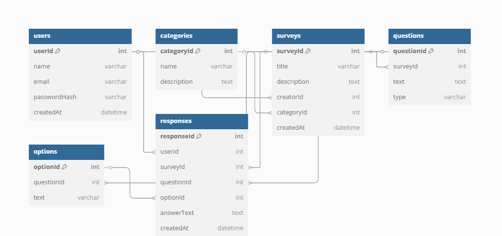

# MERN Stack Survey Platform

## 📌 Introduction

This documentation outlines the development, structure, and functionality of a full-stack survey platform built using the MERN stack (MongoDB, Express.js, React.js, Node.js). The primary objective of this platform is to provide administrators with a seamless interface to create customer surveys, collect valuable feedback, and guide users to leave online reviews.

The application streamlines the survey process with features such as authentication, input validation, CAPTCHA protection, and integration with Google Maps. The platform is designed to be accessible, intuitive, and efficient for both staff members and survey respondents.

---

## 🎯 Purpose

The purpose of this website is to provide a convenient and efficient platform for administrators to:

-Create and manage surveys.
-Collect valuable customer feedback.
-Facilitate the generation of online reviews.

The platform aims to enhance customer satisfaction and business visibility without requiring respondents to create accounts. The integration with Google Maps encourages users to leave reviews after completing a survey.

---

## 🚀 Features

- Secure admin authentication (JWT, bcrypt)
- CAPTCHA for bot protection
- Custom survey builder (MCQs, ratings, text)
- Clean public survey interface (no login required)
- View and manage responses from admin dashboard
- Mobile-first responsive design
- MongoDB database with Mongoose models
- Helmet and HTTPS for enhanced security
- Clear error messages and input validations

---

## ⚙️ Tech Stack

**Frontend:**
- React.js
- React Router DOM
- Bootstrap

**Backend:**
- Node.js
- Express.js
- MongoDB
- Mongoose

**Security:**
- bcrypt
- jsonwebtoken (JWT)
- Helmet
- CORS

---
##ER Diagram


---

## 👨‍💻 Installation & Running Locally

### 1. Prerequisites
- [Node.js](https://nodejs.org/en/download/) (v14+ recommended)
- [MongoDB](https://www.mongodb.com/try/download/community) installed or MongoDB Atlas connection

### 2. Run the Project


```bash
git clone https://github.com/KnightmareAtif/SurveyAppMERN.git
cd SurveyAppMERN

cd backend
npm install              # Install backend dependencie

PORT=5000
MONGO_URI=mongodb://localhost:27017/surveydb
JWT_SECRET=yourSecretKey              #Create a .env file in the backend folder with the following contents

#Ensure the backend server is running successfully before proceeding to the frontend setup.

node index.js              #Starting backend

cd ../frontend
npm install              # Install frontend dependencies

npm start                # Launch React app at http://localhost:3000
